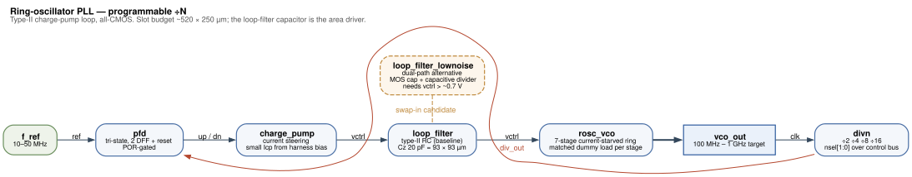

# sg13cmos5l_vyges_ip__pll_rosc

Ring-oscillator **PLL** for the IHP **SG13CMOS5L** process — a self-biased,
dual-control-path ring-VCO PLL with a register-selectable ÷N feedback divider.
**All-CMOS** (no SiGe HBT / MiM cap / deep-N-well / Schottky — none of which
SG13CMOS5L provides); the loop-filter cap is MOM/poly within the 5-metal stack.
Built for the **Chipalooza Challenge #2 (IHP SG13CMOS5L)** as an openframe
analog-slot IP.

> Status: **schematic**. The full cell hierarchy is captured in xschem, netlists, and
> simulates. See [`doc/implementation.md`](doc/implementation.md) for what is built and
> measured, and [`doc/proposal.md`](doc/proposal.md) for the original design intent.



## What it is

A foundational on-chip clock multiplier. Designed to drop into
one openframe pallet slot: 3.3 V from the slot power switch, bias from the
harness V/I references, and `enable` / ÷N-select / `lock` over the digital
control-status bus.

Measured on the schematic hierarchy; the loop figures come from a closed-loop run with
every block real except the VCO, which is behavioural and matched to the measured curve.

| Parameter | Measured | Specification |
| --- | --- | --- |
| Reference in | 16–50 MHz usable | 10–50 MHz |
| Output, typical corner | 115–735 MHz ❌ | 100–800 MHz |
| Output, guaranteed over PVT | ceiling **600 MHz** ❌ | 800 MHz |
| Divider | ÷8 and ÷16 usable (÷2, ÷4 need a reference above 50 MHz) ❌ | N = 4…64 |
| Lock time | ~4 µs ✅ | 20 µs max |
| Phase margin, N = 16 | 54.1° ✅ | 45° min |
| Phase margin, N = 8 | 49.3° ✅ (ff / −40 °C / worst-case sheet) | 45° min |
| Loop filter | Rz 80.77 kΩ, Cz 5.11 pF (63 × 63 µm) | — |

⚠️ **What is not met, stated here rather than left to be found.** Two measured
specifications fall short: the **output range** — the loaded ring tops out at 735 MHz
typical and 600 MHz at the slow corner, with the control voltage already at the supply
rail, so 800 MHz is a hard limit and not a margin; and the **divider range**, since only ÷8
and ÷16 are usable against a specified 10–50 MHz reference. Six further specifications —
period and RMS jitter, phase noise, reference spur, duty cycle and power — are **not
measured**, all for the one reason given in
[`doc/implementation.md`](doc/implementation.md). Lock detect and the output post-divider
are **not implemented**.

✅ **Phase margin at N = 8 now passes**, at 49.3° where this table read 38.4°. Nothing in
the block changed: it was re-pinned to IHP-Open-PDK `dev@ab1510c`, where base and overlay
live in one tree. Two changes in that pin both helped — the `rhigh` corner re-alignment
(+4.1°) and, worth more than twice as much, the MoM capacitor's rename `cap_mfringe` →
`cap_cmomf` with its density recalibrated 2.32 → 1.287 fF/µm² (+9.4°), which drops `Cz` to
5.11 pF at the same drawn size and raises the loop zero. ⚠️ **Read that second one as a
warning too**: a device model moved a specification by 9.4° under a finished schematic.

## For the integrator

[`doc/implementation.md`](doc/implementation.md) carries two sections written for scoping
this block into a slot:

- **Assumptions** — the process, slot supply and harness resources the design rests on. One is load-bearing and unconfirmed: the block runs from 1.2 V and the slot supply is 3.3 V.
- **Slot requirements** — pads, harness resources, control bits and clocks. Two pads, one
  of them an up-to-735 MHz output that needs a dedicated path; the block runs entirely
  from 1.2 V, with **no 3.3 V analog rail required**.
- **Against the proposal** — every specification line with what the schematic measures,
  including the output range and divider range that fall short.

## Layout

| Dir | Contents |
| --- | --- |
| `xschem/` | schematics — `cs_inv`, `rosc_vco`, `pfd`, `charge_pump`, `loop_filter`, `divn`, `pll_rosc` |
| `doc/schematics/` | rendered SVGs of every cell, readable without opening xschem |
| `magic/` | analog layout |
| `netlist/` | extracted / simulation netlists |
| `sim/` | testbenches — **`sim/ringvco_feasibility.spice`** + `run_tuning_sweep.sh` |
| `verilog/` | digital control/status wrapper (LibreLane) |
| `signoff/` | DRC / LVS / extract / STA reports |
| `doc/` | design notes, characterization |

## Toolchain

IHP open flow: **xschem / ngspice / magic / netgen / klayout** + **LibreLane**
for digital. ngspice must support **OSDI v0.4** (the IHP PSP103 models —
SG13CMOS5L shares them with SG13G2) — use IIC-OSIC-TOOLS or ngspice ≥ 43.

[**Vyges Loom**](https://vyges.com/products/loom) provides independent sign-off
alongside it — `vyges loom lvs` gates connectivity against a known-good netlist,
`vyges loom extract` supplies parasitics once there is layout, and `vyges loom meas`
measures swept transfers. Each exits non-zero on a violation, so they run as build
gates. Install: <https://docs.vyges.com/installation.html>. Commands and results are
in [`doc/implementation.md`](doc/implementation.md).

## Reproducing the results

`sim/run.sh` netlists the schematic hierarchy and runs every testbench from a clean
clone. It needs xschem, ngspice, and the IHP PDK — **one checkout now covers both halves**,
since upstream merged the `ihp-sg13cmos5l` overlay into IHP-Open-PDK:

```sh
git clone --branch dev --recurse-submodules https://github.com/IHP-GmbH/IHP-Open-PDK.git
git -C IHP-Open-PDK checkout ab1510cbdcbd61fe82e24ec28179c02ea7083299
PDK_ROOT=$PWD/IHP-Open-PDK python3 IHP-Open-PDK/ihp-sg13g2/libs.tech/ngspice/install.py
PDK_ROOT=$PWD/IHP-Open-PDK PDK=ihp-sg13cmos5l sh sim/run.sh
```

`--recurse-submodules` is not optional, and `install.py` compiles the Verilog-A models
(`psp103`, `psp103_nqs`, `r3_cmc`, `mosvar`) that ship as sources rather than binaries.

⚠️ **One upstream gap to work around.** Both `.spiceinit` files load all six OSDI models
from `$PDK_ROOT/$PDK/libs.tech/ngspice/osdi/`, but `install.py` writes its four only into
`ihp-sg13g2`, while `ihp-sg13cmos5l` ships only the other two (`cap_cmomf`, `cap_cmomi`)
prebuilt. Neither directory holds all six, so whichever `$PDK` you select the elaboration
fails on the missing pair. Symlink the two sets into each other after installing.

`$PDK_ROOT` defaults to `/foss/pdks` (what IIC-OSIC-TOOLS sets) and `$PDK` to
`ihp-sg13g2`, so the bundled PDK still works — but it is the *old* two-repository pin and
will not reproduce the numbers above.

Apache-2.0. See [`NOTICE`](NOTICE) for attribution.
