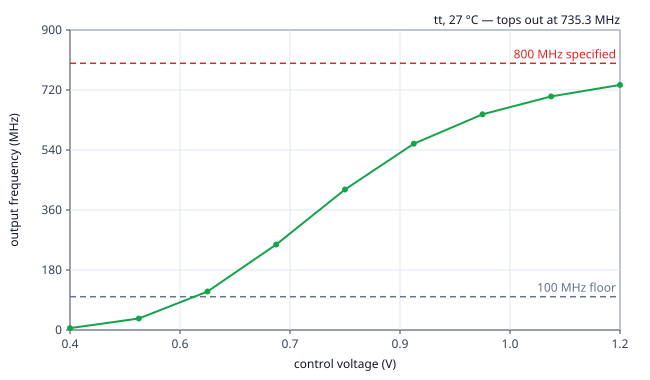
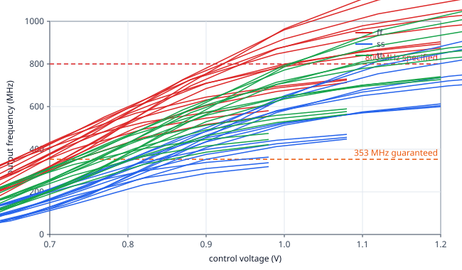
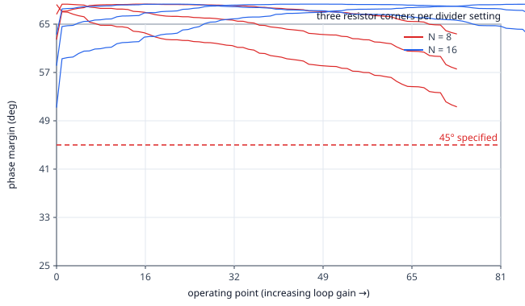

# Datasheet for pll_rosc

**netlist source**: schematic

| Parameter | Unit | Min Limit | Min Value | Typ Value | Max Limit | Max Value | Status |
| :-------- | :--- | --------: | --------: | --------: | --------: | --------: | :----: |
| VCO tuning range, low | MHz | any | 115.425 MHz | 115.425 MHz | any | 115.425 MHz | Pass ✅ |
| VCO tuning range, high | MHz | 800.000 MHz | 735.336 MHz | 735.336 MHz | any | 735.336 MHz | Fail ❌ |
| Lock time | us | any | 16.000 us | 16.000 us | 20.000 us | 16.000 us | Pass ✅ |
| Output ceiling over PVT | MHz | 800.000 MHz | 352.600 MHz | 352.600 MHz | any | 352.600 MHz | Fail ❌ |
| Phase margin, N = 8 | deg | 45.000 deg | 51.308 deg | 51.308 deg | any | 51.308 deg | Pass ✅ |
| Phase margin, N = 16 | deg | 45.000 deg | 51.192 deg | 51.192 deg | any | 51.192 deg | Pass ✅ |
| Crossover, worst / (f_ref/10) | - | any | 1.202 | 1.202 | 1.000 | 1.202 | Fail ❌ |
| Lock time, worst corner | us | any | 24.000 us | 24.000 us | 20.000 us | 24.000 us | Fail ❌ |
| Area | um2 | any | ​ | ​ | 164300.000 um2 | ​ | Skip 🟧 |
| Magic DRC | - | any | ​ | ​ | 0.000 | ​ | Skip 🟧 |
| Netgen LVS | - | any | ​ | ​ | 0.000 | ​ | Skip 🟧 |
| KLayout DRC | - | any | ​ | ​ | 0.000 | ​ | Skip 🟧 |
| Antenna violations | - | any | ​ | ​ | 0.000 | ​ | Skip 🟧 |

## Plots

### VCO tuning curve, typical corner

### VCO tuning over process and temperature

### Phase margin over Kvco and resistor corners

---

© 2026 Vyges (https://vyges.com) · generated by `tools/datasheet.py`, do not edit by hand
